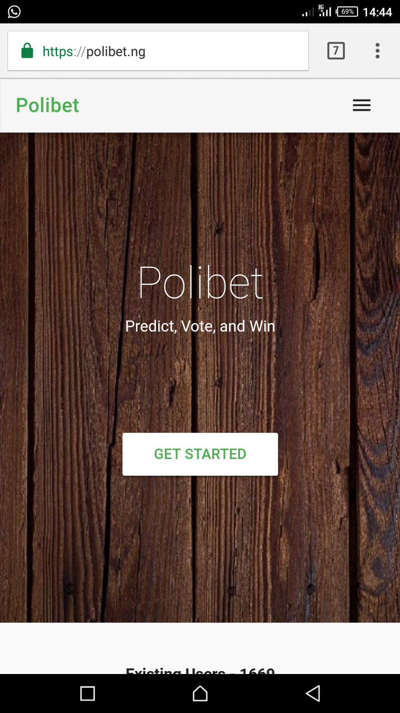
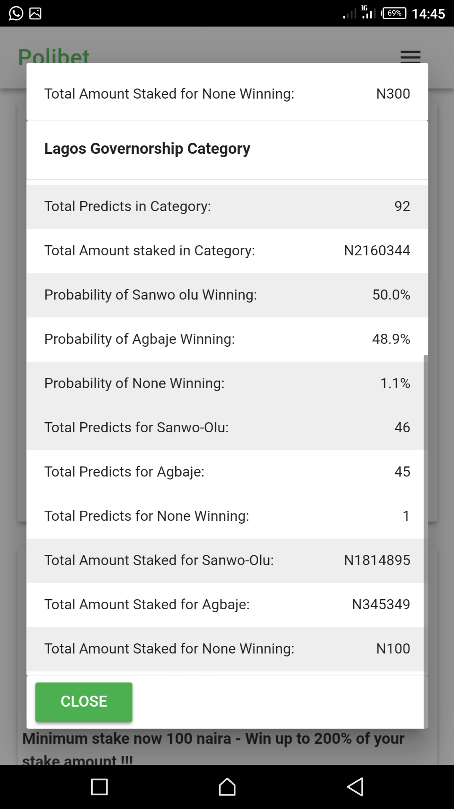
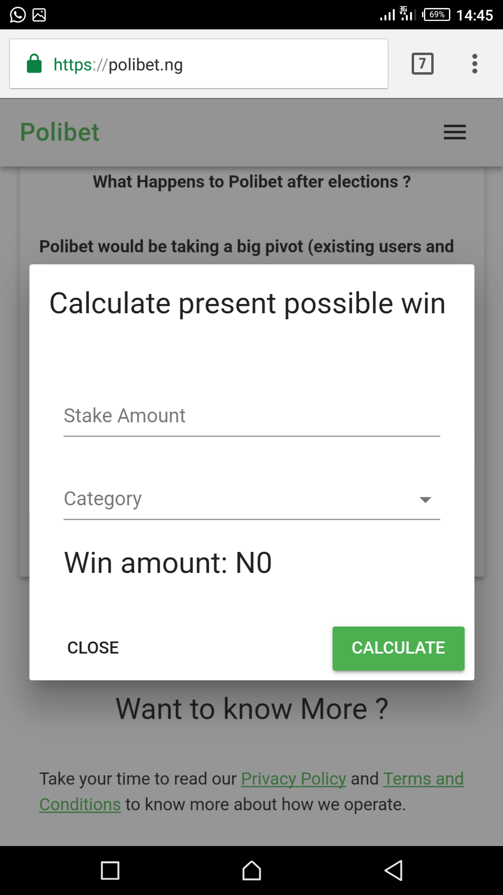
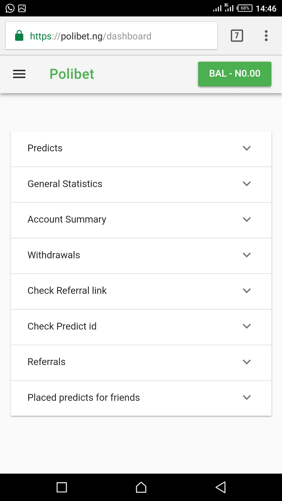

# Polibet

> https://polibet.herokuapp.com

   


## Installation

Follow this steps to build locally:

```sh
Clone project
composer install
php artisan migrate:fresh --seed
php artisan serve
```

## Details

Polibet allows you create your own bets, on your own conditions and allow others play with you. When creating a bet, you give details of the bet such as name, description, possible outcomes, outcome date and end date, minimum stake, and so. After your bet is approved, you can share with your friends or your bet gets featured on trending bets. Before staking on a bet, you can see your possible wins which is calculated using an algorithm based on number of options and number of stakes present. The outcome of the stake is decided by the creator and can be disputed by the participants.

  

